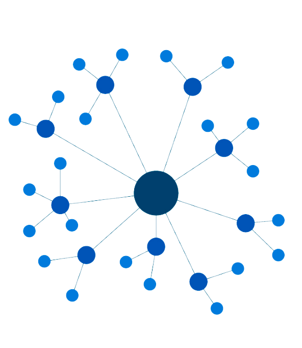
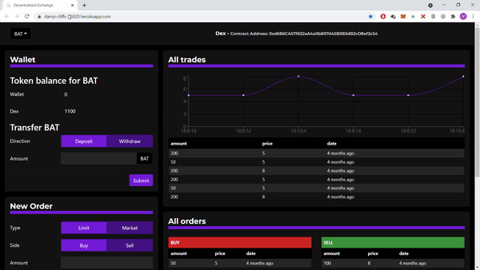
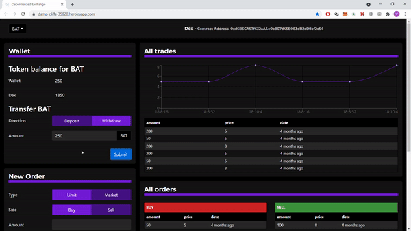
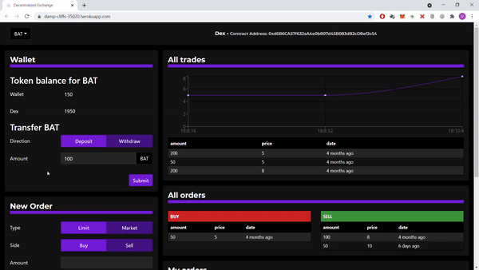
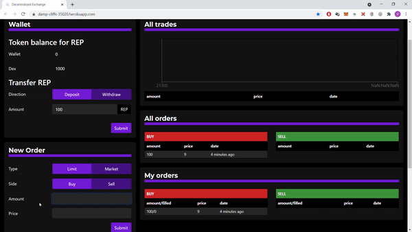

<!--
*** Thanks for checking out the Best-README-Template. If you have a suggestion
*** that would make this better, please fork the repo and create a pull request
*** or simply open an issue with the tag "enhancement".
*** Thanks again! Now go create something AMAZING! :D
-->

<!-- PROJECT SHIELDS -->
<!--
*** I'm using markdown "reference style" links for readability.
*** Reference links are enclosed in brackets [ ] instead of parentheses ( ).
*** See the bottom of this document for the declaration of the reference variables
*** for contributors-url, forks-url, etc. This is an optional, concise syntax you may use.
*** https://www.markdownguide.org/basic-syntax/#reference-style-links
-->

[![Contributors][contributors-shield]][contributors-url]
[![Forks][forks-shield]][forks-url]
[![Stargazers][stars-shield]][stars-url]
[![Issues][issues-shield]][issues-url]
[![MIT License][license-shield]][license-url]
[![LinkedIn][linkedin-shield]][linkedin-url]

<!-- PROJECT LOGO -->
<br />
<p align="center">
  <a href="https://damp-cliffs-35020.herokuapp.com/">
    
  </a>

  <h3 align="center">Decentralized Exchange</h3>

  <p align="center">
    A P2P Cryptocurrency Exchange.
    <br />
    <a href="https://github.com/vinivst/Dex/#getting-started"><strong>Explore the docs »</strong></a>
    <br />
    <br />
    <a href="https://damp-cliffs-35020.herokuapp.com/">View Demo</a>
    ·
    <a href="https://github.com/vinivst/Dex/issues">Report Bug</a>
    ·
    <a href="https://github.com/vinivst/Dex/issues">Request Feature</a>
  </p>
</p>

<!-- TABLE OF CONTENTS -->
<details open="open">
  <summary>Table of Contents</summary>
  <ol>
    <li>
      <a href="#about-the-project">About The Project</a>
      <ul>
        <li><a href="#built-with">Built With</a></li>
      </ul>
    </li>
    <li>
      <a href="#getting-started">Getting Started</a>
      <ul>
        <li><a href="#prerequisites">Prerequisites</a></li>
        <li><a href="#installation">Installation</a></li>
      </ul>
    </li>
    <li><a href="#usage">Usage</a></li>
    <li><a href="#tests">Tests</a></li>
    <li><a href="#roadmap">Roadmap</a></li>
    <li><a href="#contributing">Contributing</a></li>
    <li><a href="#license">License</a></li>
    <li><a href="#contact">Contact</a></li>
    <li><a href="#acknowledgements">Acknowledgements</a></li>
  </ol>
</details>

<!-- ABOUT THE PROJECT -->

## About The Project

[![Product Name Screen Shot][product-screenshot]](https://damp-cliffs-35020.herokuapp.com/)

A P2P Cryptocurrency Exchange demonstration in which you can:

- Generate tokens with the faucet
- Deposit tokens from wallet to Dex
- Withdraw tokens from Dex to wallet
- Check the lastest transactions of a token
- Buy and sell tokens
- Place a limit order
- Place a market order
- Check for all open orders
- Check for your open orders

There are initially 4 Registered tokens:

    - BAT
    - REP
    - DAI
    - ZRX

The BAT token is the base token for all other trades, which means that every order is matched against BAT, ie. when you open a Buy Market Order for 100 REP, you are Trading whatever the price in BAT is for 100 REPs and so on.

The orders are automatically matched against the best price open orders and can be partially filled.

A list of commonly used resources that I find helpful are listed in the acknowledgements.

### Built With

- [Solidity](https://soliditylang.org/)
- [React](https://reactjs.org/)
- [Bootstrap](https://getbootstrap.com/)
- [Truffle](https://www.trufflesuite.com/)
- [Web3](https://web3js.readthedocs.io/)
- [Metamask](https://metamask.io/)
- [OpenZeppelin](https://openzeppelin.com/)

<!-- GETTING STARTED -->

## Getting Started

In the following sections you will learn how to clone this repo and get it up and running in no time.

### Prerequisites

You need to have npm installed.

- Download and install node, which already comes with npm:
  - [Download Node](https://nodejs.org/en/download/)

### Installation

1. Clone the repo (--recurse-submodules to include the client's submodule folder)
   ```sh
   git clone --recurse-submodules https://github.com/vinivst/Dex.git
   ```
2. Install NPM packages in project ("backend")
   ```sh
   npm install
   ```
3. Install NPM packages in client
   ```sh
   cd client
   npm install
   ```
4. Register a new account in [Infura](https://infura.io/) and create a new project to get your kovan key at
   https://infura.io/dashboard/ethereum

5. Create a .env file at root path

6. Create and save inside the .env the following:
   1. The MNEMONIC (12 words seed phrase from your wallet)
   2. INFURA_KEY (that you got from step 3)
   ```sh
   MNEMONIC = globe nephew genre emotion morning best penalty trade bid glare unaware dragon
   INFURA_KEY = https://kovan.infura.io/v3/you_key_here
   ```
7. Deploy your smart contracts
   ```sh
   truffle migrate --network kovan
   ```
8. Change to client directory and run react
   ```sh
   cd client
   npm start
   ```
9. Enjoy your new Dex Dapp! :smile:

<!-- USAGE EXAMPLES -->

## Usage (Metamask didn't shows in the gifs)

Generate tokens with the faucet:



Withdraw tokens from Dex to wallet:


Deposit tokens from wallet to Dex:



Place a limit order:



Place a market order:



<!-- TESTS -->

## Tests

You can see all the tests inside the test folder. The tests were all made using Truffle and Web3. To run the tests simply use:

```sh
truffle test
```

<!-- ROADMAP -->

## Roadmap

See the [open issues](https://github.com/vinivst/Dex/issues) for a list of proposed features (and known issues).

<!-- CONTRIBUTING -->

## Contributing

Contributions are what make the open source community such an amazing place to be learn, inspire, and create. Any contributions you make are **greatly appreciated**.

1. Fork the Project
2. Create your Feature Branch (`git checkout -b feature/AmazingFeature`)
3. Commit your Changes (`git commit -m 'Add some AmazingFeature'`)
4. Push to the Branch (`git push origin feature/AmazingFeature`)
5. Open a Pull Request

<!-- LICENSE -->

## License

Distributed under the GNU GPLv3 License. See `LICENSE` for more information.

<!-- CONTACT -->

## Contact

Vinicius Santiago - [Linkedin](https://www.linkedin.com/in/vinivst/)

Project Link: [https://github.com/vinivst/Dex](https://github.com/vinivst/Dex)

<!-- ACKNOWLEDGEMENTS -->

## Acknowledgements

- [GitHub Emoji Cheat Sheet](https://www.webpagefx.com/tools/emoji-cheat-sheet)
- [Best-README-Template](https://github.com/othneildrew/Best-README-Template)
- [Choose an Open Source License](https://choosealicense.com)

<!-- MARKDOWN LINKS & IMAGES -->
<!-- https://www.markdownguide.org/basic-syntax/#reference-style-links -->

[contributors-shield]: https://img.shields.io/github/contributors/vinivst/Dex.svg?style=for-the-badge
[contributors-url]: https://github.com/vinivst/Dex/graphs/contributors
[forks-shield]: https://img.shields.io/github/forks/vinivst/Dex.svg?style=for-the-badge
[forks-url]: https://github.com/vinivst/Dex/network/members
[stars-shield]: https://img.shields.io/github/stars/vinivst/Dex.svg?style=for-the-badge
[stars-url]: https://github.com/vinivst/Dex/stargazers
[issues-shield]: https://img.shields.io/github/issues/vinivst/Dex.svg?style=for-the-badge
[issues-url]: https://github.com/vinivst/Dex/issues
[license-shield]: https://img.shields.io/github/license/vinivst/Dex.svg?style=for-the-badge
[license-url]: https://github.com/vinivst/Dex/blob/master/LICENSE.txt
[linkedin-shield]: https://img.shields.io/badge/-LinkedIn-black.svg?style=for-the-badge&logo=linkedin&colorB=555
[linkedin-url]: https://www.linkedin.com/in/vinivst/
[product-screenshot]: ./images/screenshot.PNG
